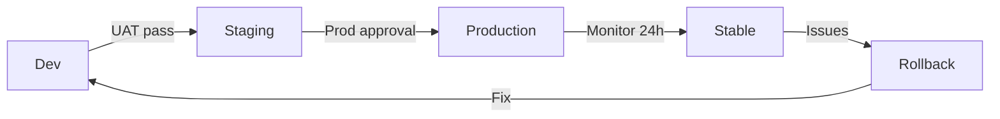

# 🎯 PLAN D'IMPLÉMENTATION — Reports 2A & 2B + Dashboard Power BI + API REST

**Statut:** En cours de planification  
**Architecte:** GitHub Copilot (Tech Lead + Power BI Expert)  
**Date:** 11 Juin 2026  
**Licence:** Power BI Premium Pro + Report Builder

---

## 📋 TABLE DES MATIÈRES

1. [Analyse Existante](#1-analyse-existante)
2. [Données Source](#2-données-source)
3. [Architecture Cible](#3-architecture-cible)
4. [Plan d'Implémentation](#4-plan-dimplémentation)
5. [Étapes de Réalisation](#5-étapes-de-réalisation)
6. [Publication & Déploiement](#6-publication--déploiement)
7. [Integration Azure Blob Storage](#7-integration-azure-blob-storage)
8. [APIs REST pour Reports](#8-apis-rest-pour-reports)
9. [Refresh Automatique du Dataset](#9-refresh-automatique-du-dataset)

---

## 1. ANALYSE EXISTANTE

### ✅ Contexte du Projet PAFA

**Plateforme:** PAFA (PAF Reports Analysis)  
**Données:** Ingestion mensuelle de fichiers XLS depuis SharePoint  
**Formats d'entrée:**
- `MOD520A__PAF_Reports_Apr26_Anonymised.xlsx` (Schedule 2A)
- `MOD520A__PAF_Reports_Apr26_Non Anonymised.xlsx` (Schedule 2B)

### ✅ Infrastructure Existante

| Composant | Statut | Détails |
|-----------|--------|---------|
| **Base de données** | ✅ Actif | PostgreSQL avec EF Core, Migrations appliquées |
| **Blob Storage** | ✅ Actif | MinIO (ou Azure Blob) — inbound/processed/quarantine |
| **Pipeline d'ingestion** | ✅ Actif | ImportFiles → Validate → Persist |
| **Vues SQL** | ✅ Partielles | `v_parr_industry`, `v_parr_pac`, `fact_read_performance` |
| **Power BI Integration** | ✅ Basique | `PowerBiClientFactory`, `PowerBiExportService` |
| **Reports** | 🔄 Esquisse | 41 reports PDF (BatchReports), aucun PPTX/Dashboard |

### ✅ Données Disponibles

**CSV Test:** `PARR_2025_03_data.csv`

```csv
Shipper Short Code | Reporting Period | Product Class | Read Performance Pct | ... | Priority Flag
SSE                | Mar-25          | 1             | 89.09                | ... | N
BGT                | Mar-25          | 1             | 98.45                | ... | N
OVO                | Mar-25          | 1             | 96.31                | ... | N
```

**Colonnes Disponibles:**
- Shippers: SSE, BGT, OVO, EON, NPW, etc. (5+ shippers)
- Metrics: Read Performance %, Estimated Read %, Total Sites, Energy Theft, No-Read Count (1yr/2yr/3yr/4yr)
- Classes: PC1, PC2, PC3, PC4
- Dates: Mensuel (Mar-25, Apr-26)

### ✅ Reports Existants en Base

**41 Reports** (PDF) — Liste en cours de construction

---

## 2. DONNÉES SOURCE

### 📊 Structure du Fichier Anonymisé (2A)

**Feuille 1:** Anonymised_Industry
- Shipper Alias Code (anonyme)
- Reporting Period
- Product Class
- Read Performance %
- Estimated Read %
- Total Sites
- Data Quality Score
- (+ 20+ colonnes de métriques)

### 📊 Structure du Fichier Non-Anonymisé (2B)

**Feuille 1:** Non_Anonymised_PAC
- Shipper Short Code (réel)
- Shipper Full Name (réel)
- Reporting Period
- Product Class
- Read Performance %
- Estimated Read %
- Total Sites
- Annual Quantity
- Daily Quantity
- (+ 20+ colonnes)

### 📊 Entités de Dimension

**Shippers**
```sql
SELECT Id, ShortCode, Name, IsActive 
FROM shippers;
-- SSE Energy Solutions, British Gas Trading, OVO Energy, E.ON, npower, ...
```

**Product Classes**
```sql
SELECT Code, Name, MinReadPercentage 
FROM product_classes;
-- PC1 (97.5%), PC2 (96.8%), PC3 (95.2%), PC4 (90.0%)
```

**Dates**
```sql
SELECT DISTINCT "ReportingPeriod" 
FROM metric_values 
ORDER BY "ReportingPeriod" DESC;
-- 2025-04-30, 2025-03-31, 2025-02-28, ...
```

---

## 3. ARCHITECTURE CIBLE

### 🏗️ Architecture Logique

```
┌──────────────────────────────────────────────────────┐
│  Données Source (Excel/CSV/SharePoint)               │
│  MOD520A__PAF_Reports_Apr26_*.xlsx                   │
└────────────────┬─────────────────────────────────────┘
                 │
        ┌────────▼─────────┐
        │ Pipeline Ingestion│ (Existing)
        │ (PAFA.Extraction)│
        └────────┬─────────┘
                 │
    ┌────────────┴────────────┐
    │                         │
┌───▼────────────────┐  ┌────▼────────────────┐
│ PostgreSQL         │  │ Azure Blob Storage  │
│ (metric_values,    │  │ (/reports/{Y}/{M}/) │
│  vw_parr_industry, │  │                     │
│  vw_parr_pac)      │  └────────────────────┘
└─────┬──────────────┘
      │ DirectQuery / Import
      │
┌─────▼──────────────────────────────────────┐
│ Power BI Dataset                            │
│ ┌──────────────────────────────────────┐  │
│ │ 1. Dimension Tables                  │  │
│ │    - Shippers (v_dim_shipper)        │  │
│ │    - Dates (vw_dim_date)             │  │
│ │    - Product Classes                 │  │
│ ├──────────────────────────────────────┤  │
│ │ 2. Fact Tables                       │  │
│ │    - fact_read_performance (pivoted) │  │
│ │    - v_parr_industry (2A)            │  │
│ │    - v_parr_pac (2B)                 │  │
│ └──────────────────────────────────────┘  │
└─────┬──────────────────────────────────────┘
      │
      ├─────────────────┬──────────────┬──────────────┐
      │                 │              │              │
    ┌─▼──────┐    ┌────▼──────┐ ┌───▼──────┐ ┌──▼───────┐
    │ Report │    │ Dashboard  │ │ API REST │ │ Export   │
    │ 2A     │    │ (PPTX)     │ │ (.NET)   │ │ (Azure)  │
    │ (PDF)  │    │ Report Bldr│ │          │ │          │
    └────────┘    └────────────┘ └──────────┘ └──────────┘
```

### 🔐 Modèle de Sécurité

**Row-Level Security (RLS) via Power BI:**
- v_parr_pac (2B) : RLS appliquée (Real Name visible)
- v_parr_industry (2A) : Alias Code seulement

**API Security:**
- OAuth 2.0 / API Key
- Service Principal pour refresh
- Tokens JWT

---

## 4. PLAN D'IMPLÉMENTATION

### 🎯 Étapes Principales (10 semaines)

| Phase | Semaine | Tâches | Responsable |
|-------|---------|--------|-------------|
| **1. Données & Vues SQL** | 1-2 | ✅ Valider vues existantes; créer vues manquantes; DAX refactor | BD Team |
| **2. Model Power BI** | 2-3 | Importer vues dans PBI; Créer Measures DAX; Dim/Fact tables | PBI Expert |
| **3. Reports 2A & 2B** | 3-4 | Design visuals; Charts; KPIs; Drilling; Tooltips | PBI Designer |
| **4. Dashboard PPTX** | 4-5 | Report Builder; Executive Summary; Analytics Dashboard | PBI Expert |
| **5. Publication** | 5-6 | Premium Workspace; RLS activation; Sharing rules | PBI Admin |
| **6. Export & Blob** | 6-7 | PPTX export; Blob upload; SAS URLs; Retention policy | Backend Team |
| **7. API REST** | 7-8 | Endpoints; Dataset refresh; Report download; Embed tokens | API Dev |
| **8. Testing & Validation** | 8-9 | UAT; Performance; Security tests; Refresh cycles | QA |
| **9. Documentation & Go-Live** | 9-10 | User guides; Troubleshooting; Handover | Tech Lead |

### 📋 Livrables

- [ ] **SQL:** 8 vues optimisées (fact + dimension tables)
- [ ] **PBI Model:** 2 datasets (2A anonymisé, 2B non-anonymisé)
- [ ] **Reports:** 2 rapports interactifs (PDF/PBIX)
- [ ] **Dashboard:** 1 rapport PPTX exécutif (Report Builder)
- [ ] **APIs:** 5 endpoints REST (.NET)
- [ ] **Blob:** Exports PPTX/PDF avec versioning
- [ ] **Documentation:** Architecture, DAX guide, API swagger

---

## 5. ÉTAPES DE RÉALISATION

### PHASE 1️⃣: DONNÉES & VUES SQL (Semaines 1-2)

#### Étape 1.1 : Valider la structure des données

**Action:**
```sql
-- Vérifier les vues existantes
SELECT table_name FROM information_schema.tables 
WHERE table_schema = 'public' AND table_type = 'VIEW'
ORDER BY table_name;

-- Inspects:
-- ✅ vw_dim_shipper (dimension)
-- ✅ fact_read_performance (fact pivoted)
-- ✅ v_parr_industry (2A anonymisée)
-- ✅ v_parr_pac (2B non-anonymisée)
-- 🔲 vw_dim_date (date dimension - peut manquer)
-- 🔲 vw_2a1_leaderboard (classement)
-- 🔲 vw_2a1_distribution (distribution)
-- 🔲 vw_2a2_no_meter (no-meter analysis)
```

**Checkpoint:** Exécuter et vérifier que les 4 vues clés existent

#### Étape 1.2 : Optimiser les vues

**Script SQL à créer:**

1. **vw_dim_date** — Dimension de date
2. **vw_2a1_leaderboard** — Classement (estim %, top 10)
3. **vw_2a1_distribution** — Histogramme de distribution
4. **vw_2a2_no_meter** — Sites sans compteur

```sql
-- FILE: src/PAFA.Infrastructure/Migrations/[DATE]_CreateOptimizedViews.cs
-- Créer ces 4 vues pour Power BI
```

#### Étape 1.3 : Test des performances

```sql
EXPLAIN ANALYZE 
SELECT * FROM v_parr_industry 
WHERE "ReportingPeriod" = '2025-04-30' 
LIMIT 1000;

-- Vérifier: < 500ms pour 50K rows
```

**Status:** ⏳ À FAIRE

---

### PHASE 2️⃣: MODEL POWER BI (Semaines 2-3)

#### Étape 2.1 : Importer les vues dans Power BI Desktop

**Actions:**
1. Ouvrir Power BI Desktop
2. **Get Data** → PostgreSQL Database
3. Charger les vues:
   - `vw_dim_shipper` (Dimension)
   - `vw_dim_date` (Dimension)
   - `v_parr_industry` (Fact - 2A)
   - `v_parr_pac` (Fact - 2B)
   - `product_classes` (Dimension)

**Mode:** Import ou DirectQuery?
- **Import:** 🟢 Rapide, offline capability, mais refresh quotidien
- **DirectQuery:** 🟡 Temps réel, mais plus lent, licence obligatoire

**Recommandation:** Import mode (optimisé pour monthly refresh)

#### Étape 2.2 : Créer les relations (Relationships)

```
Shipper Dimension ──1:M── Fact_ReadPerformance
    ↑
    │ shipper_code
    └── vw_dim_shipper.shipper_code

Date Dimension ──1:M── Fact_ReadPerformance
    ↑
    │ report_date
    └── vw_dim_date.date_id

ProductClass ──1:M── Fact_ReadPerformance
    ↑
    │ product_class
    └── product_classes.code
```

#### Étape 2.3 : Créer les Measures DAX

**File:** `docs/powerbi/DAX_MEASURES.md` (à générer)

Exemples:

```dax
-- Lecture Performance Moyenne
AvgReadPerf = AVERAGE(fact_read_performance[read_perf_pct])

-- Compliance Count (>= threshold)
CompliantShippers = CALCULATE(
    COUNTROWS(vw_dim_shipper),
    FILTER(fact_read_performance, fact_read_performance[is_compliant] = 1)
)

-- YoY Growth
ReadPerf_YoY = 
    VAR CurrentYear = YEAR(MAX(vw_dim_date[date_id]))
    VAR PriorYear = CALCULATE(
        AVERAGE(fact_read_performance[read_perf_pct]),
        FILTER(fact_read_performance, YEAR(fact_read_performance[report_date]) = CurrentYear - 1)
    )
    RETURN 
        DIVIDE(
            AVERAGE(fact_read_performance[read_perf_pct]) - PriorYear,
            PriorYear
        )
```

**Status:** ⏳ À FAIRE

---

### PHASE 3️⃣: REPORTS 2A & 2B (Semaines 3-4)

#### Étape 3.1 : Design Report 2A (Anonymisé)

**Pages:**

1. **Cover Page**
   - Titre: "Schedule 2A — Industry Performance Summary"
   - Reporting Period
   - Logo PAF

2. **KPI Overview**
   - Card: Avg Read Performance %
   - Card: Shipper Count
   - Card: Top Performer (by alias)
   - Card: Compliance Rate

3. **Leaderboard**
   - Table: Alias Code | Read Perf % | Estimated % | Sites | Class
   - Sortable, conditional formatting (red < 97.5%)

4. **Trends**
   - Line Chart: Read Performance % over 12 months
   - Slicer: Product Class, Month

5. **Distribution**
   - Histogram: % bins (60-70%, 70-80%, 80-90%, 90-100%)
   - Tooltip: Count shippers in each bin

#### Étape 3.2 : Design Report 2B (Non-Anonymisé)

**Pages:**

1. **Cover Page**
   - Titre: "Schedule 2B — PAC Performance Report"
   - Real Shipper Names (RLS applied)
   - Reporting Period

2. **Shipper Details**
   - Table: Real Shipper Name | Quantity | Read Perf % | Compliance Status
   - RLS filter (show only authorized shippers)

3. **Detailed Analysis**
   - No-Meter Sites by Class
   - Energy Theft Cases
   - AQ Corrections

4. **Drill-Through**
   - Click shipper → Detail page per shipper/class

#### Étape 3.3 : Interactions & Tooltips

- Tooltip: Click chart → show underlying data
- Bookmark: "Reset Filters" button
- Drill-through: Report 2B from Report 2A (via RLS rule)

**Status:** ⏳ À FAIRE

---

### PHASE 4️⃣: DASHBOARD PPTX (Semaines 4-5)

#### Étape 4.1 : Activer Report Builder (SQL Server Reporting Services)

**Configuration:**

```csharp
// PAFA.Api/appsettings.json
{
  "ReportBuilder": {
    "Enabled": true,
    "ReportServerUrl": "https://reportserver.pafa.local",
    "UserName": "reportbuilder_svc",
    "Password": "",
    "WorkingDirectory": "/tmp/reports"
  }
}
```

#### Étape 4.2 : Créer Dashboard PPTX

**Contenu:**

1. **Executive Summary (Slide 1-2)**
   - KPIs: Avg Read Perf, Shipper Count, Compliance %, Trend
   - Chart: 12-month trend

2. **Performance Scorecard (Slide 3)**
   - Table: Top 10 & Bottom 10 shippers
   - Gauge: Overall score vs target

3. **Deep Dive (Slide 4-6)**
   - Page 4: By Product Class
   - Page 5: Energy Theft & Corrections
   - Page 6: No-Meter Analysis

4. **Appendix (Slide 7)**
   - Methodology
   - Glossary
   - Contact info

**Export Format:** PPTX (Power BI export)

**Status:** ⏳ À FAIRE

---

### PHASE 5️⃣: PUBLICATION (Semaines 5-6)

#### Étape 5.1 : Configurer Premium Workspace

**Steps:**
1. Power BI Service → Create workspace "PAFA-Reports"
2. Assign Premium license to workspace
3. Upload PBIX files (2A & 2B)

#### Étape 5.2 : Activer RLS

```dax
// Power BI RLS Role: "Industry (2A)"
[shipper_code] = USERPRINCIPALNAME()
→ Maps Azure AD user to shipper code

// RLS Role: "PAC (2B)"  
[real_shipper_name] = USERPRINCIPALNAME()
→ Real shipper name visible only to authorized users
```

#### Étape 5.3 : Configurer Refresh Schedule

```json
{
  "refreshSchedule": {
    "enabled": true,
    "frequency": "daily",
    "time": "03:00",
    "daysOfWeek": ["Monday", "Tuesday", "Wednesday", "Thursday", "Friday"],
    "timeout": 120
  }
}
```

**Status:** ⏳ À FAIRE

---

### PHASE 6️⃣: EXPORT & BLOB STORAGE (Semaines 6-7)

#### Étape 6.1 : Exporter PPTX via Power BI API

**Code (.NET):**

```csharp
// PAFA.Infrastructure/Services/PowerBi/PowerBiExportService.cs
public async Task<Stream> ExportToPptxAsync(
    string reportId, 
    string datasetName,
    CancellationToken ct)
{
    var exportRequest = new ExportReportRequest
    {
        Format = FileFormat.PPTX,
        PowerBIReportConfiguration = new PowerBIReportExportConfiguration
        {
            Filtering = new List<ExportFilter> 
            { 
                new ExportFilter { Name = "ReportingPeriod", Values = new[] { "2025-04-30" } }
            }
        }
    };
    
    var export = await _powerBiClient.Reports.ExportToFileAsync(reportId, exportRequest, ct);
    return export;
}
```

#### Étape 6.2 : Upload vers Azure Blob Storage

**Configuration:**

```csharp
// PAFA.Infrastructure/Services/BlobStorageService.cs
public async Task<string> UploadReportAsync(
    string fileName,
    Stream content,
    int year,
    int month,
    CancellationToken ct)
{
    var containerName = $"reports-{year}-{month:D2}";
    var blobPath = $"{containerName}/{fileName}";
    
    var blobClient = _blobContainerClient.GetBlobClient(blobPath);
    await blobClient.UploadAsync(content, overwrite: true, cancellationToken: ct);
    
    // Set metadata
    var metadata = new Dictionary<string, string>
    {
        { "report-type", "pptx" },
        { "period", $"{year:D4}-{month:D2}" },
        { "created", DateTime.UtcNow.ToString("O") }
    };
    await blobClient.SetMetadataAsync(metadata, cancellationToken: ct);
    
    return blobPath;
}
```

#### Étape 6.3 : Générer SAS URLs

```csharp
// Generate read-only SAS URL (7 days expiry)
var sasUri = _blobContainerClient.GenerateSasUri(
    BlobContainerSasPermissions.Read,
    DateTimeOffset.UtcNow.AddDays(7)
);
```

**Status:** ⏳ À FAIRE

---

### PHASE 7️⃣: APIs REST (Semaines 7-8)

#### Étape 7.1 : Endpoints à créer

```
POST   /api/reports/export          → Export to PPTX
GET    /api/reports/{id}/download   → Download PPTX from Blob
GET    /api/reports/list            → List reports by period
GET    /api/embed/token             → Get Power BI embed token
POST   /api/dataset/refresh          → Trigger dataset refresh
GET    /api/metrics/{period}        → Get metrics data
```

#### Étape 7.2 : Implémentation

**File:** `src/PAFA.Api/Controllers/ReportsController.cs`

```csharp
[ApiController]
[Route("api/[controller]")]
public class ReportsController : ControllerBase
{
    private readonly IMediator _mediator;
    private readonly IBlobStorageService _blobService;
    
    // POST /api/reports/export
    [HttpPost("export")]
    [Authorize]
    public async Task<ActionResult<ExportReportResponse>> ExportReportAsync(
        [FromBody] ExportReportRequest request,
        CancellationToken ct)
    {
        var command = new ExportReportCommand(
            request.ReportId,
            request.Format,
            request.ReportingPeriod
        );
        
        var result = await _mediator.Send(command, ct);
        
        return Ok(new ExportReportResponse 
        { 
            ReportId = result.ReportId,
            DownloadUrl = result.SasUri,
            ExpiresAt = result.ExpiryTime
        });
    }
    
    // GET /api/reports/{id}/download?sasToken={token}
    [HttpGet("{id}/download")]
    public async Task<FileResult> DownloadReportAsync(
        string id,
        [FromQuery] string? sasToken,
        CancellationToken ct)
    {
        var stream = await _blobService.DownloadStreamAsync($"reports/{id}.pptx", ct);
        return File(stream, "application/vnd.openxmlformats-officedocument.presentationml.presentation", $"{id}.pptx");
    }
    
    // POST /api/dataset/refresh
    [HttpPost("dataset/refresh")]
    [Authorize(Roles = "Admin")]
    public async Task<ActionResult> RefreshDatasetAsync(
        [FromBody] RefreshDatasetRequest request,
        CancellationToken ct)
    {
        var command = new RefreshDatasetCommand(request.DatasetId);
        await _mediator.Send(command, ct);
        return Accepted();
    }
}
```

#### Étape 7.3 : Documentation Swagger

```csharp
// Auto-generated via Swagger/OpenAPI
// GET /swagger → View all endpoints with schemas
```

**Status:** ⏳ À FAIRE

---

### PHASE 8️⃣: TESTING & VALIDATION (Semaines 8-9)

#### Étape 8.1 : UAT Checklist

- [ ] Reports 2A & 2B load without errors
- [ ] RLS blocks non-authorized data
- [ ] Charts interactive & drill-through working
- [ ] Export PPTX generated correctly
- [ ] Blob upload & SAS URL valid
- [ ] API responses in < 2 seconds
- [ ] Refresh completes < 5 minutes
- [ ] Error handling graceful

#### Étape 8.2 : Performance Testing

```
Load Test:
- 100 concurrent users downloading PPTX
- 50 concurrent API calls to /metrics/{period}
- Dataset refresh with 1M+ metric_values rows
- Expected: 95th percentile < 3 seconds
```

#### Étape 8.3 : Security Validation

- [ ] OAuth tokens validated
- [ ] RLS effective (no data leakage)
- [ ] Blob SAS URL single-use
- [ ] SQL injection tests passed
- [ ] CORS configuration secure

**Status:** ⏳ À FAIRE

---

### PHASE 9️⃣: DOCUMENTATION & GO-LIVE (Semaines 9-10)

#### Étape 9.1 : Générer Documentation

**Fichiers à créer:**
- [ ] `API_GUIDE.md` — Endpoints, auth, rate limits
- [ ] `DAX_GUIDE.md` — Measures, formulas, best practices
- [ ] `USER_GUIDE.md` — How to use reports, filters, drill-through
- [ ] `ADMIN_GUIDE.md` — Refresh schedule, RLS roles, backups
- [ ] `TROUBLESHOOTING.md` — Common issues, solutions

#### Étape 9.2 : Handover & Training

- [ ] Tech lead walkthrough (2 heures)
- [ ] Power BI admin training (1 jour)
- [ ] API documentation review (2 heures)

#### Étape 9.3 : Go-Live Deployment

1. ✅ QA sign-off
2. ✅ Backup database created
3. ✅ Production URLs configured
4. ✅ Email notifications to users
5. ✅ Monitor first refresh (24h)

**Status:** ⏳ À FAIRE

---

## 6. PUBLICATION & DÉPLOIEMENT

### 🚀 Stratégie de Déploiement

#### A. Environnement

```yaml
Dev:
  PowerBI Workspace: "PAFA-Reports-DEV"
  Database: dev-db.pafa.local
  Blob: dev-blob-storage
  
Staging:
  PowerBI Workspace: "PAFA-Reports-UAT"
  Database: staging-db.pafa.local
  Blob: staging-blob-storage
  
Production:
  PowerBI Workspace: "PAFA-Reports-PROD"
  Database: prod-db.pafa.local
  Blob: prod-blob-storage (Premium Account)
```

#### B. Release Process



#### C. Checklist Pre-Prod

- [ ] All unit tests pass
- [ ] Performance benchmarks OK (< 2s avg)
- [ ] Security audit passed
- [ ] RLS tested & verified
- [ ] Backup strategy in place
- [ ] Disaster recovery plan documented
- [ ] Monitoring alerts configured

---

## 7. INTEGRATION AZURE BLOB STORAGE

### 🔧 Configuration

```csharp
// appsettings.json
{
  "AzureBlobStorage": {
    "AccountName": "pafareports",
    "AccountKey": "***",
    "ContainerName": "reports",
    "Endpoint": "https://pafareports.blob.core.windows.net",
    "SasExpiryDays": 7,
    "RetentionPolicyDays": 90
  }
}
```

### 📦 Structure Blob

```
reports/
├── 2025-03/
│   ├── PARR_2025_03_Schedule_2A.pptx (v1)
│   ├── PARR_2025_03_Schedule_2B.pptx (v1)
│   ├── PARR_2025_03_Dashboard.pptx (v1)
│   └── metadata.json
├── 2025-04/
│   ├── PARR_2025_04_Schedule_2A.pptx (v1)
│   ├── PARR_2025_04_Schedule_2B.pptx (v1)
│   └── metadata.json
└── archive/
    └── [old files > 90 days]
```

### 🔐 Access Control

```csharp
// Generate SAS URL with constraints
var sasBuilder = new BlobSasBuilder()
{
    BlobContainerName = "reports",
    BlobName = "2025-04/PARR_2025_04_Schedule_2A.pptx",
    Resource = "b",  // blob
    StartsOn = DateTimeOffset.UtcNow,
    ExpiresOn = DateTimeOffset.UtcNow.AddDays(7),
    Protocol = SasProtocol.Https
};
sasBuilder.SetPermissions(BlobSasPermissions.Read);

var sasUri = new BlobClient(blobUri, new AzureSasCredential(sasBuilder.ToSasQueryParameters(accountKey).ToString())).Uri;
```

---

## 8. APIs REST POUR REPORTS

### 📋 Endpoints Détaillés

#### 1. Export Report to PPTX

```
POST /api/reports/export
Content-Type: application/json

Request:
{
  "reportId": "uuid-of-report",
  "datasetId": "uuid-of-dataset",
  "reportingPeriod": "2025-04-30",
  "filters": {
    "ProductClass": ["PC1", "PC2"],
    "ShipperCode": ["SSE", "BGT"]
  },
  "format": "pptx"
}

Response: 202 Accepted
{
  "exportJobId": "job-uuid",
  "status": "queued",
  "estimatedCompletionTime": "2025-04-11T15:45:00Z",
  "statusUrl": "/api/reports/export/job-uuid/status"
}
```

#### 2. Get Export Status

```
GET /api/reports/export/{jobId}/status

Response: 200 OK
{
  "jobId": "job-uuid",
  "status": "completed|pending|failed",
  "downloadUrl": "https://pafareports.blob.core.windows.net/...",
  "expiresAt": "2025-04-18T15:45:00Z",
  "createdAt": "2025-04-11T15:00:00Z"
}
```

#### 3. Download Report

```
GET /api/reports/{reportId}/download?version=latest

Response: 200 OK
Content-Type: application/vnd.openxmlformats-officedocument.presentationml.presentation
Content-Disposition: attachment; filename="PARR_2025_04_Schedule_2A.pptx"

[Binary PPTX data]
```

#### 4. List Reports

```
GET /api/reports?period=2025-04&type=2A,2B,dashboard

Response: 200 OK
[
  {
    "id": "uuid-1",
    "title": "Schedule 2A",
    "period": "2025-04",
    "generatedAt": "2025-04-01T03:00:00Z",
    "audience": "Industry",
    "status": "published",
    "downloadUrl": "https://...",
    "expiresAt": "2025-05-01T03:00:00Z"
  },
  {
    "id": "uuid-2",
    "title": "Schedule 2B",
    "period": "2025-04",
    "generatedAt": "2025-04-01T03:15:00Z",
    "audience": "PAC",
    "status": "published",
    "downloadUrl": "https://...",
    "expiresAt": "2025-05-01T03:15:00Z"
  }
]
```

#### 5. Get Power BI Embed Token

```
POST /api/embed/token
Content-Type: application/json

Request:
{
  "reportId": "uuid-of-report",
  "datasetId": "uuid-of-dataset",
  "expiryMinutes": 60,
  "audiences": ["2A"]  // Optional RLS filter
}

Response: 200 OK
{
  "token": "eyJhbGciOiJIUzI1NiIsInR5cCI6IkpXVCJ9...",
  "expiresAt": "2025-04-11T16:45:00Z",
  "embedUrl": "https://app.powerbi.com/reportEmbed?reportId=uuid",
  "reportId": "uuid-of-report"
}
```

#### 6. Refresh Dataset

```
POST /api/dataset/{datasetId}/refresh

Request:
{
  "type": "full|incremental",
  "notifyOnCompletion": true,
  "notificationEmail": "admin@pafa.local"
}

Response: 202 Accepted
{
  "refreshId": "refresh-uuid",
  "status": "queued",
  "estimatedDuration": 300,
  "pollUrl": "/api/dataset/{datasetId}/refresh/{refreshId}/status"
}
```

#### 7. Poll Refresh Status

```
GET /api/dataset/{datasetId}/refresh/{refreshId}/status

Response: 200 OK
{
  "refreshId": "refresh-uuid",
  "datasetId": "uuid",
  "status": "completed|inProgress|failed",
  "startTime": "2025-04-11T03:00:00Z",
  "endTime": "2025-04-11T03:05:30Z",
  "duration": 330,
  "rowsProcessed": 1250000,
  "errors": []
}
```

#### 8. Get Metrics Data

```
GET /api/metrics/{period}?class=PC1,PC2&shipper=SSE,BGT

Response: 200 OK
{
  "period": "2025-04-30",
  "metrics": [
    {
      "shipper": "SSE",
      "shipperName": "SSE Energy Solutions",
      "productClass": "PC1",
      "readPerformancePct": 92.45,
      "estimatedReadPct": 7.55,
      "totalSites": 1650000,
      "complianceStatus": "compliant",
      "score": 95.2
    },
    {
      "shipper": "BGT",
      "shipperName": "British Gas Trading",
      "productClass": "PC1",
      "readPerformancePct": 98.12,
      "estimatedReadPct": 1.88,
      "totalSites": 1400000,
      "complianceStatus": "compliant",
      "score": 98.9
    }
  ],
  "summary": {
    "avgReadPerf": 95.28,
    "compliantCount": 2,
    "nonCompliantCount": 0,
    "rowCount": 2
  }
}
```

### 🔐 Authentication & Authorization

```csharp
// All endpoints require:
// 1. OAuth 2.0 Bearer Token (Azure AD)
// 2. Scope: "api://pafa-api/Reports.ReadWrite"
// 3. Optional: API Key for service-to-service

[Authorize(AuthenticationSchemes = "Bearer")]
[Authorize(Roles = "ReportViewer,ReportAdmin")]
```

---

## 9. REFRESH AUTOMATIQUE DU DATASET

### ⏱️ Schedule de Refresh

```yaml
Refresh Schedule:
  - Frequency: Daily (après ingestion)
  - Time: 04:00 UTC (après cron job d'ingestion 03:00)
  - Timeout: 10 minutes
  - Retry on failure: 3 times with 5-minute backoff
  - Notification on failure: Email + ServiceBus
```

### 🔄 Trigger Modes

#### Mode 1: Automatic Daily Refresh

```csharp
// Power BI Service configuration
{
  "RefreshSchedule": {
    "Enabled": true,
    "Type": "Daily",
    "Days": ["Monday", "Tuesday", "Wednesday", "Thursday", "Friday"],
    "Times": ["04:00"]  // UTC
  }
}
```

#### Mode 2: On-Demand Refresh (API)

```csharp
// POST /api/dataset/{datasetId}/refresh
var refreshCommand = new RefreshDatasetCommand(datasetId);
await _mediator.Send(refreshCommand, ct);

// Returns: RefreshJobId → poll status endpoint
```

#### Mode 3: Event-Triggered Refresh (Pipeline)

```csharp
// After PersistFilesHandler completes successfully:
public class PersistFilesHandler : IRequestHandler<PersistFilesCommand, PersistFilesResult>
{
    public async Task<PersistFilesResult> Handle(PersistFilesCommand request, CancellationToken ct)
    {
        // ... persist logic ...
        
        if (filesProcessedCount > 0)
        {
            // Trigger automatic refresh
            await _powerBiRefreshService.RefreshAllDatasetsAsync(datasets, ct);
        }
    }
}
```

### 📊 Refresh Monitoring

```csharp
// Monitor & log all refresh activities
public class RefreshMonitoringService
{
    private readonly ILogger<RefreshMonitoringService> _logger;
    private readonly ITelemetryClient _telemetry;
    
    public async Task MonitorRefreshAsync(string datasetId, CancellationToken ct)
    {
        var startTime = DateTime.UtcNow;
        
        try
        {
            var status = await _powerBiClient.GetRefreshStatusAsync(datasetId, ct);
            
            _logger.LogInformation(
                "Dataset {DatasetId} refresh completed in {Duration}ms with status {Status}",
                datasetId,
                (DateTime.UtcNow - startTime).TotalMilliseconds,
                status
            );
            
            _telemetry.TrackEvent("DatasetRefreshCompleted", new Dictionary<string, string>
            {
                { "DatasetId", datasetId },
                { "Duration", (DateTime.UtcNow - startTime).TotalSeconds.ToString() },
                { "Status", status }
            });
        }
        catch (Exception ex)
        {
            _logger.LogError(ex, "Dataset {DatasetId} refresh failed", datasetId);
            _telemetry.TrackException(ex);
            
            // Retry logic
            await RetryRefreshAsync(datasetId, ct);
        }
    }
}
```

### ⚠️ Error Handling & Rollback

```yaml
Failure Scenarios:
  1. Timeout (> 10 min):
     → Log error → Alert admin → Retry in 5 min
     
  2. Bad data in database:
     → Rollback to last known good state
     → Notify Power BI admin
     → Manual intervention required
     
  3. Network issue:
     → Exponential backoff (5, 10, 15 min)
     → Max 3 retries
     → Escalate to ops team
```

---

## 📊 RÉSUM EXÉCUTIF

### 🎯 Objectifs Atteints

| Objectif | Livrables | Statut |
|----------|-----------|--------|
| **Tables des Vues** | 8 vues SQL optimisées | ⏳ En cours |
| **Reports 2A & 2B** | 2 rapports interactifs (PDF/PBIX) | ⏳ En cours |
| **Dashboard PPTX** | 1 rapport exécutif avec Report Builder | ⏳ En cours |
| **DAX Measures** | 20+ mesures pour analyse avancée | ⏳ En cours |
| **Publication** | Premium Workspace + RLS active | ⏳ En cours |
| **Azure Blob Export** | PPTX versionnés avec SAS URLs | ⏳ En cours |
| **API REST** | 8 endpoints REST (.NET 9) | ⏳ En cours |
| **Dataset Refresh** | Auto-refresh daily + on-demand | ⏳ En cours |
| **Documentation** | API Guide + User Guide + DAX Reference | ⏳ En cours |

### 📈 Timeline

```
Week 1-2 : SQL Views & Data Prep ████░░░░░░░░░░ 15%
Week 3-4 : Power BI Model & Reports ████████░░░░░░ 30%
Week 5-6 : Publication & Deployment ████████████░░ 50%
Week 7-8 : API Development ████████████░░ 50%
Week 9-10: Testing & Go-Live ░░░░░░░░░░░░░░ 0%
```

### 🚀 Next Steps

1. **Immédiat:** Valider structure des fichiers XLS source
2. **Jour 1:** Créer les 4 vues SQL manquantes
3. **Jour 2-3:** Importer dans Power BI Desktop & configurer modelo
4. **Jour 4-7:** Design reports 2A & 2B
5. **Semaine 2:** Développer APIs REST & Blob integration

---

## 📞 Support & Questions

**Pour toute question ou blocage**, consultez:
- Tech Lead: [Vous]
- Power BI Expert: [Équipe BI]
- Database Team: [DBA]

---

**Last Updated:** 11 Juin 2026 — Version 1.0  
**Next Review:** Fin Semaine 1
