# PAFA Platform — Architecture & Developer Guide

> Généré le 22 mai 2026. Reflète l'état exact du code source.

---

## Table des matières

1. [Vue d'ensemble de la solution](#1-vue-densemble-de-la-solution)
2. [Diagramme de dépendances entre projets](#2-diagramme-de-dépendances-entre-projets)
3. [Module PAFA.Domain](#3-module-pafadomain)
4. [Module PAFA.Infrastructure](#4-module-pafainfrastructure)
5. [Module PAFA.Messaging](#5-module-pafamessaging)
6. [Module PAFA.Notifications](#6-module-pafanotifications)
7. [Module PAFA.Extraction](#7-module-pafaextraction)
8. [Module PAFA.Worker — Pipeline orchestration](#8-module-pafafworker--pipeline-orchestration)
9. [Module PAFA.Api](#9-module-pafaapi)
10. [Module PAFA.Reports](#10-module-pafareports)
11. [Module PAFA.BatchReports](#11-module-pafabatchreports)
12. [Flux 1 — Ingestion manuelle (3 étapes)](#12-flux-1--ingestion-manuelle-3-étapes)
13. [Flux 2 — Pipeline Background Worker](#13-flux-2--pipeline-background-worker)
14. [Flux 3 — Validation et quarantaine](#14-flux-3--validation-et-quarantaine)
15. [Flux 4 — Notification via Azure Service Bus](#15-flux-4--notification-via-azure-service-bus)
16. [Flux 5 — Refresh du dataset Power BI](#16-flux-5--refresh-du-dataset-power-bi)
17. [Flux 6 — Ingestion automatique (BatchReports / CronJob)](#17-flux-6--ingestion-automatique-batchreports--cronjob)
18. [Base de données — Entités clés](#18-base-de-données--entités-clés)
19. [Résumé des APIs exposées](#19-résumé-des-apis-exposées)

---

## 1. Vue d'ensemble de la solution

La plateforme PAFA est composée de **9 projets .NET 9** organisés en couches :

```
┌─────────────────────────────────────────────────────────┐
│                      Clients / Frontend                 │
│          (HTTP REST + SignalR WebSocket)                 │
└────────────┬───────────────────────────┬────────────────┘
             │                           │
    ┌────────▼────────┐       ┌──────────▼──────────┐
    │   PAFA.Api      │       │   PAFA.Worker        │
    │  (Port 5000)    │       │   (Port 5001)         │
    │  Auth, Reports  │       │  Pipeline Run/Status  │
    │  File Upload    │       │  SignalR /hubs/pipeline│
    └────────┬────────┘       └──────────┬────────────┘
             │                           │
             └──────────┬────────────────┘
                        │  MediatR Commands
             ┌──────────▼───────────┐
             │   PAFA.Extraction    │
             │  ImportFilesHandler  │
             │  ParseAndValidate..  │
             │  PersistFilesHandler │
             └──────────┬───────────┘
                        │
          ┌─────────────┼─────────────┐
          │             │             │
 ┌────────▼──────┐ ┌───▼────┐ ┌─────▼──────────┐
 │PAFA.Infra-    │ │PAFA.   │ │PAFA.           │
 │structure      │ │Messag- │ │Notifications   │
 │(EF,Blob,SP,   │ │ing     │ │(EmailContent,  │
 │ PowerBI)      │ │(AzBus) │ │ Settings)      │
 └────────┬──────┘ └────────┘ └────────────────┘
          │
 ┌────────▼──────┐
 │  PAFA.Domain  │
 │  (Entities,   │
 │   Interfaces, │
 │   Enums)      │
 └───────────────┘
```

---

## 2. Diagramme de dépendances entre projets

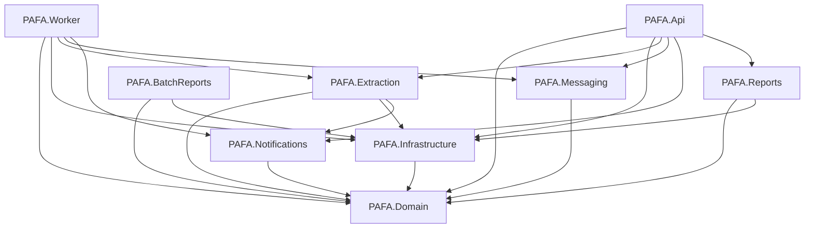

---

## 3. Module PAFA.Domain

### Rôle
Contient **toutes les entités, interfaces, enums et contrats** du domaine métier. Aucune dépendance externe.

### Interfaces clés
| Interface | Implémentation | Description |
|---|---|---|
| `IBlobStorageService` | `MinioBlobStorageService` / `LocalBlobStorageService` | Upload, download, move, delete, GenerateReadUrl |
| `IRemoteFileSource` | `SharePointFileSource` | ListFiles, DownloadStream, PatchStatus |
| `IEmailService` | `ServiceBusNotificationService` | SendValidationFailure, SendIngestionFailure, SendWelcome |
| `IUnitOfWork` | `UnitOfWork` | Accès aux repositories + SaveChangesAsync |

### Enums pipeline (nouveaux)
```csharp
public enum ImportStatus    { Imported, SkippedInvalidName, SkippedInvalidFolder }
public enum PipelineStatus  { Pending, Running, Success, Error }
public enum StepStatus      { Pending, Running, Success, Error, Skipped }
```

### Diagramme entités principales
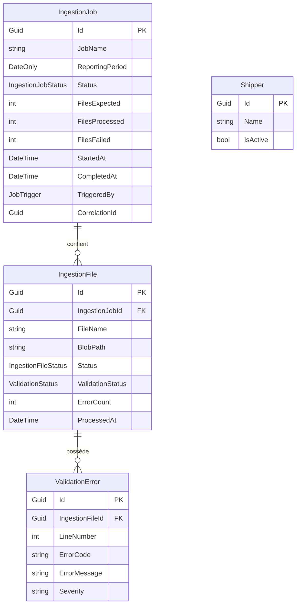

---

## 4. Module PAFA.Infrastructure

### Rôle
Implémentation concrète de toutes les interfaces du domaine : EF Core, Blob Storage, SharePoint Graph API, Power BI.

### Ce dont il a besoin (appsettings)
```json
{
  "ConnectionStrings": { "DefaultConnection": "Host=...;Database=pafadb" },
  "BlobStorage": {
    "Provider": "MinIO",
    "Endpoint": "localhost:9000",
    "AccessKey": "...",
    "SecretKey": "..."
  },
  "SharePoint": {
    "TenantId": "...",
    "ClientId": "...",
    "ClientSecret": "...",
    "SiteUrl": "https://tenant.sharepoint.com/sites/PAFA",
    "SiteId": "...",
    "DriveId": "..."
  },
  "PowerBi": {
    "TenantId": "...",
    "ClientId": "...",
    "ClientSecret": "...",
    "WorkspaceId": "..."
  }
}
```

### Services exposés
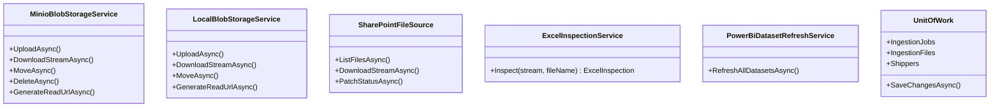

---

## 5. Module PAFA.Messaging

### Rôle
Publication d'événements sur **Azure Service Bus**. Un consommateur aval (Azure Function / Logic App) reçoit ces messages et envoie les emails.

### Ce dont il a besoin
```json
{
  "ServiceBus": {
    "ConnectionString": "Endpoint=sb://pafa-bus.servicebus.windows.net/;...",
    "ValidationFailureTopic": "pafa-validation-failure",
    "IngestionFailureTopic": "pafa-ingestion-failure",
    "WelcomeTopic": "pafa-user-welcome"
  }
}
```

### Messages publiés
| Topic | Message | Déclencheur |
|---|---|---|
| `pafa-validation-failure` | `ValidationFailureMessage` | Fichier mis en quarantaine (Step 2/3) |
| `pafa-ingestion-failure` | `IngestionFailureMessage` | Échec total du pipeline (AC10) |
| `pafa-user-welcome` | `WelcomeMessage` | Création d'un nouvel utilisateur |

### Diagramme
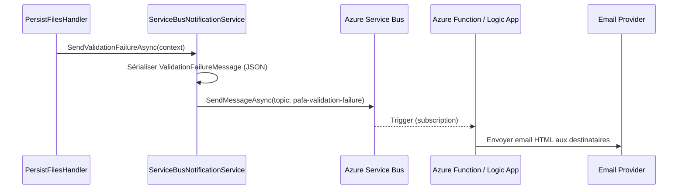

### Structure de ServiceBusNotificationService
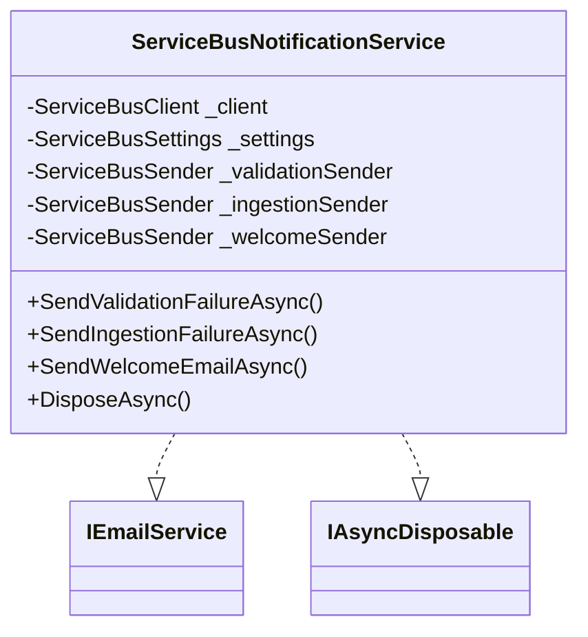

---

## 6. Module PAFA.Notifications

### Rôle
Construction du **contenu** des notifications (corps HTML, pièce jointe CSV). Indépendant du canal d'envoi.

### Services exposés
| Classe | Méthode | Description |
|---|---|---|
| `EmailContentBuilder` | `BuildHtmlBody(ctx)` | Corps HTML de l'email de validation |
| `EmailContentBuilder` | `BuildCsvBytes(errors)` | Pièce jointe CSV avec toutes les erreurs |
| `NotificationSettings` | — | Configuration des destinataires par type |

### Ce dont il a besoin
```json
{
  "Notifications": {
    "ValidationFailureRecipients": ["admin@pafa.com"],
    "IngestionFailureRecipients": ["ops@pafa.com"]
  }
}
```

---

## 7. Module PAFA.Extraction

### Rôle
Tous les **MediatR handlers** métier : import, parse/validation, persistance, gestion utilisateurs.

### Handlers pipeline (nouveaux)
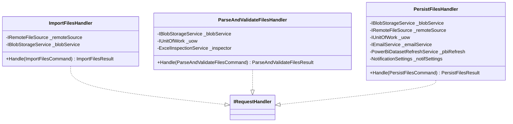

### Règles de validation (Step 2)
| # | Règle | Condition de déclenchement |
|---|---|---|
| 1 | **Change of File Name** | Nom différent du fichier du mois précédent (même préfixe) |
| 2 | **Change of Table Name** | Nom d'onglet générique (Sheet1, Feuil1…) |
| 3 | **Missing Field** | Colonne requise absente selon le préfixe du fichier |
| 4 | **Change of Shippers** | Shipper dans le fichier absent de la table `shippers` |
| 5 | **Invalid Value** | Valeur numérique > 100 dans une colonne taux/pourcentage |
| 6 | **Hidden Columns** | Colonnes masquées détectées dans le classeur Excel |

### Colonnes requises par préfixe
| Préfixe | Colonnes obligatoires |
|---|---|
| MOD520A | Shipper, Product Class, Period |
| RPT_1364 | Shipper, Period |
| MOD700 | Shipper, Period |
| EUC09 | Shipper, Period |
| TRANSFER | Shipper, Period |
| CLASS4AQ | Shipper, Period |

---

## 8. Module PAFA.Worker — Pipeline orchestration

### Rôle
Application web **dédiée à l'orchestration manuelle du pipeline** d'ingestion. Héberge le `PipelineBackgroundService`, le hub SignalR, et les endpoints REST de contrôle.

### Ce dont il a besoin (Services DI)

| Service | Interface | Description |
|---|---|---|
| `PipelineBackgroundService` | `IPipelineBackgroundService` | Hosted service + channel consumer |
| `InMemoryPipelineStateStore` | `IPipelineStateStore` | État en mémoire (thread-safe) |
| `PipelineHub` | — | Hub SignalR `/hubs/pipeline` |
| `IMediator` (MediatR) | — | Exécution des 3 handlers |
| `IBlobStorageService` | MinIO / Local | Blob storage |
| `IRemoteFileSource` | SharePointFileSource | Accès SharePoint |
| `IEmailService` | ServiceBusNotificationService | Notifications |
| `IUnitOfWork` | UnitOfWork | Accès base de données |
| `PowerBiDatasetRefreshService` | — | Refresh Power BI |
| `ExcelInspectionService` | — | Parsing Excel (ClosedXML) |

### APIs exposées

| Méthode | Route | Auth | Description |
|---|---|---|---|
| `POST` | `/api/pipeline/run` | `PafaAdmin` | Lance le pipeline pour un mois donné |
| `GET` | `/api/pipeline/status/{jobId}` | `PafaAdmin` | Retourne l'état complet du job |
| `GET` | `/swagger` | — | Documentation Swagger |
| `WS` | `/hubs/pipeline` | — | Hub SignalR — événements temps réel |

#### Corps de la requête `POST /api/pipeline/run`
```json
{
  "year": 2025,
  "month": 11
}
```
*(year et month sont optionnels — défaut = mois courant UTC)*

#### Réponse 202 Accepted
```json
{
  "jobId": "3fa85f64-5717-4562-b3fc-2c963f66afa6",
  "status": "started",
  "month": "2025-11"
}
```

#### Réponse `GET /api/pipeline/status/{jobId}`
```json
{
  "jobId": "3fa85f64-...",
  "correlationId": "8b4e1234-...",
  "year": 2025,
  "month": 11,
  "startedAt": "2025-11-22T10:00:00Z",
  "finishedAt": "2025-11-22T10:03:45Z",
  "overallStatus": "Success",
  "steps": [
    { "stepNumber": 1, "name": "Import des fichiers",  "status": "Success", "durationMs": 12340 },
    { "stepNumber": 2, "name": "Parsing + Validation", "status": "Success", "durationMs": 45210 },
    { "stepNumber": 3, "name": "Persistance",          "status": "Success", "durationMs": 8920  }
  ]
}
```

### Architecture interne du Worker

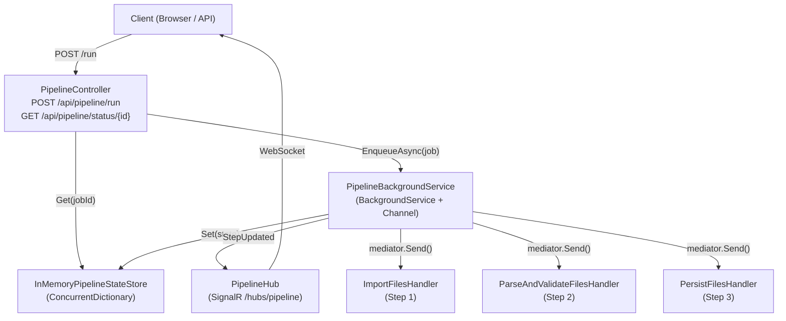

---

## 12. Flux 1 — Ingestion manuelle (3 étapes)

L'ingestion manuelle est déclenchée par un appel HTTP au PAFA.Worker.

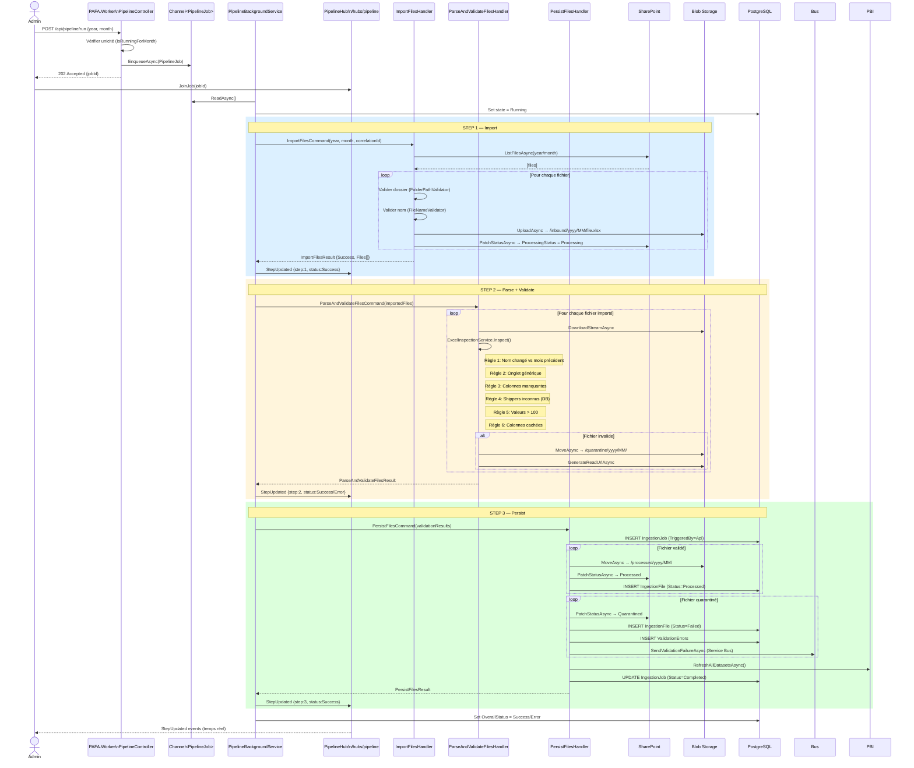

---

## 13. Flux 2 — Pipeline Background Worker

Le `PipelineBackgroundService` tourne en arrière-plan dans PAFA.Worker.

### Mécanisme du Channel
```
Channel<PipelineJob> (bounded, capacity=20, SingleReader)
         │
  ┌──────▼──────────────────────────────────────────────────┐
  │  PipelineBackgroundService.ExecuteAsync()               │
  │                                                         │
  │  while (!cancellationToken.IsCancellationRequested)     │
  │      job = await _channel.Reader.ReadAsync()            │
  │      await ProcessJobAsync(job)                         │
  └─────────────────────────────────────────────────────────┘
```

### Gestion des états
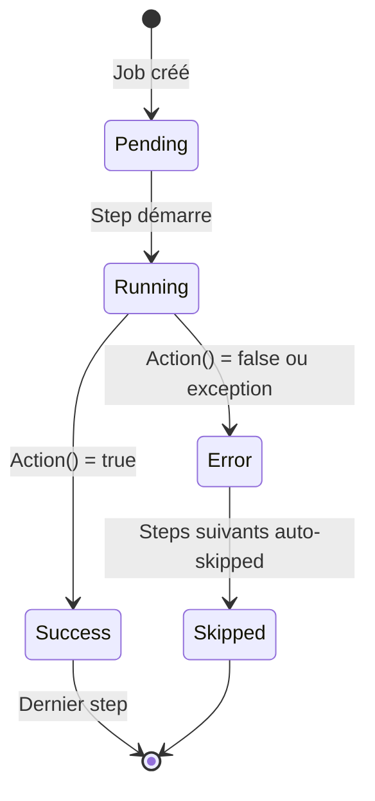

### Propagation des résultats entre steps
```
Step 1 result → ImportFilesResult.Files
    │
    └─► filtrer Status == Imported
         │
    Step 2 input → IReadOnlyList<ImportedFile>
         │
         └─► ParseAndValidateFilesResult.Files
              │
         Step 3 input → IReadOnlyList<ParseAndValidateResult>
```

### Événement SignalR `StepUpdated`
```json
{
  "jobId":         "3fa85f64-5717-4562-b3fc-2c963f66afa6",
  "correlationId": "8b4e1234-abcd-...",
  "stepNumber":    2,
  "stepName":      "Parsing + Validation",
  "status":        "Success",
  "durationMs":    45210,
  "stepResult":    [ { "fileName": "MOD520A__2025_11.xlsx", "status": "Valid" } ]
}
```

---

## 14. Flux 3 — Validation et quarantaine

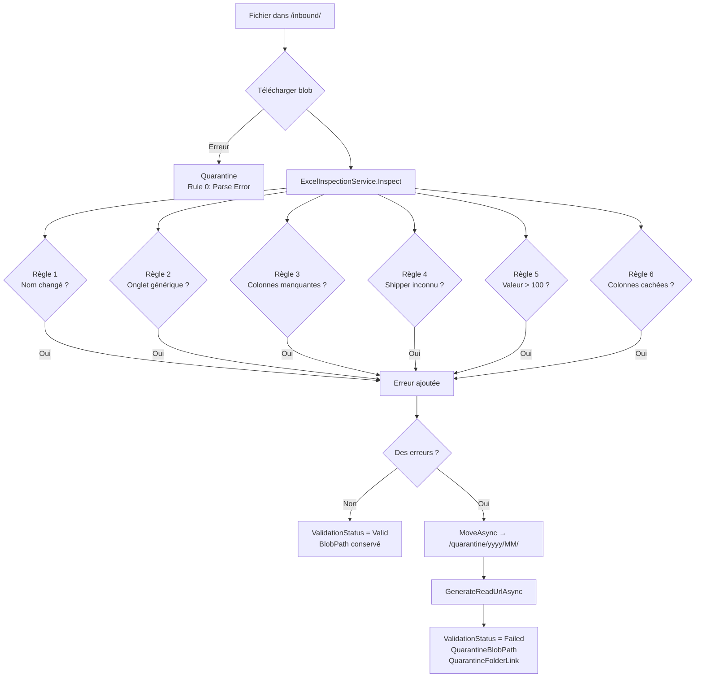

---

## 15. Flux 4 — Notification via Azure Service Bus

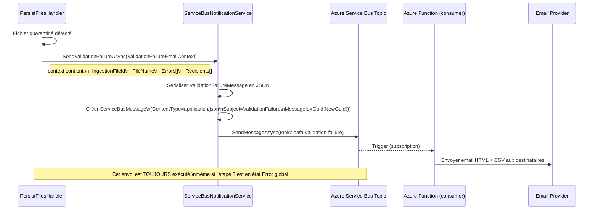

### Payload `ValidationFailureMessage`
```json
{
  "ingestionFileId":  "uuid",
  "fileName":         "MOD520A__2025_11.xlsx",
  "reportingPeriod":  "2025-11",
  "sourceSystem":     "PARR",
  "totalErrors":      3,
  "errors": [
    {
      "rowNumber":    12,
      "columnName":   "Shipper",
      "errorCode":    "Rule 4 — Change of Shippers",
      "severity":     "ERROR",
      "errorMessage": "Unknown shipper: XYZ Corp",
      "originalValue": "XYZ Corp"
    }
  ],
  "recipients":       ["admin@pafa.com"],
  "publishedAtUtc":   "2025-11-22T10:03:12Z"
}
```

---

## 16. Flux 5 — Refresh du dataset Power BI

Le refresh est déclenché **automatiquement à la fin du Step 3**, si au moins un fichier a été persisté en base.

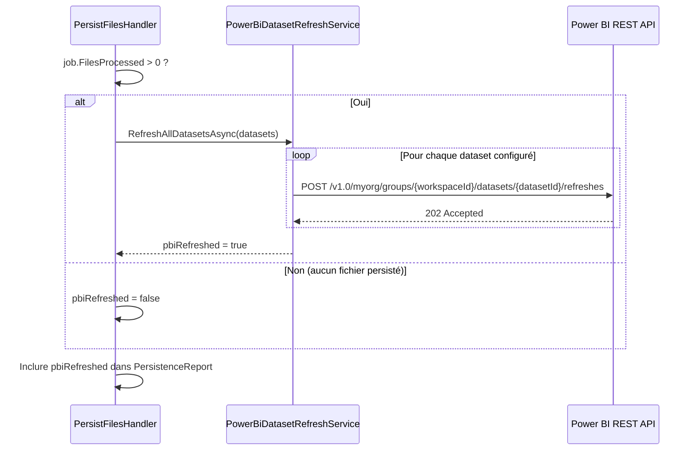

### Configuration requise
```json
{
  "PowerBiBatchExport": {
    "IsEnabled": true,
    "Datasets": [
      { "WorkspaceId": "guid-workspace", "DatasetId": "guid-dataset-sch2a" },
      { "WorkspaceId": "guid-workspace", "DatasetId": "guid-dataset-sch2b" }
    ]
  },
  "PowerBi": {
    "TenantId": "...",
    "ClientId": "...",
    "ClientSecret": "..."
  }
}
```

---

## 17. Flux 6 — Ingestion automatique (BatchReports / CronJob)

La version automatique est exécutée par `PAFA.BatchReports` — une console app déclenchée par un CronJob Kubernetes.

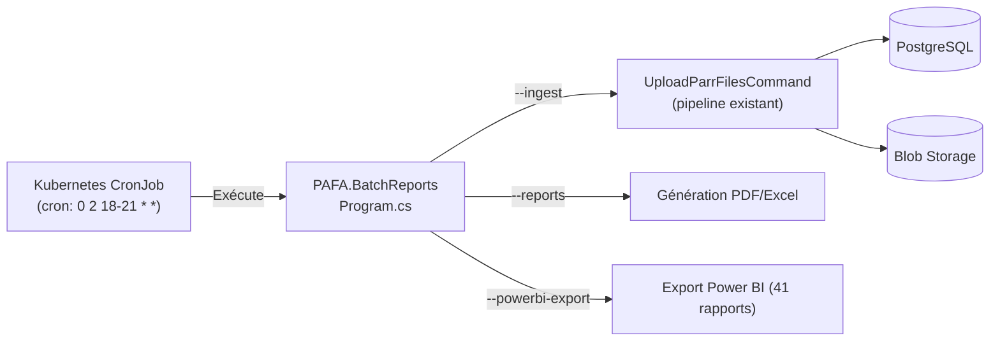

**Différence avec l'ingestion manuelle :**
| Aspect | Manuel (PAFA.Worker) | Automatique (PAFA.BatchReports) |
|---|---|---|
| Déclencheur | `POST /api/pipeline/run` | Kubernetes CronJob |
| Pipeline | 3 steps MediatR (Import→Parse→Persist) | `UploadParrFilesCommand` (flux historique) |
| `JobTrigger` | `Api` | `Scheduled` |
| Observabilité | SignalR temps réel | Logs K8s uniquement |
| Période | Au choix | Mois courant UTC |

---

## 18. Base de données — Entités clés

### Blob Storage — Conventions de chemins
```
/inbound/yyyy/MM/filename.xlsx         ← Step 1: fichier importé
/quarantine/yyyy/MM/filename.xlsx      ← Step 2: fichier invalide
/processed/yyyy/MM/filename.xlsx       ← Step 3: fichier validé et persisté
/exports/yyyy/MM/report.pdf            ← Batch: exports Power BI
```

### SharePoint — Champs patchés via Graph API
| Champ | Valeur | Moment |
|---|---|---|
| `ProcessingStatus` | `Processing` | Step 1 — dès l'upload en blob |
| `ProcessingStatus` | `Processed` | Step 3 — fichier validé persisté |
| `ProcessingStatus` | `Quarantined` | Step 3 — fichier en quarantaine |

### Migration EF Core appliquée
```
20260522134739_AddCorrelationIdToIngestionJob
→ ALTER TABLE ingestion_jobs ADD COLUMN correlation_id UUID NULL
```

---

## 19. Résumé des APIs exposées

### PAFA.Api — Port 5000
| Méthode | Route | Auth | Description |
|---|---|---|---|
| POST | `/api/auth/login` | Public | Authentification JWT |
| GET | `/api/users` | PafaAdmin | Liste des utilisateurs |
| POST | `/api/users` | PafaAdmin | Créer un utilisateur |
| POST | `/api/ingest/start` | PafaAdmin | Lancer ingestion (flux historique) |
| GET | `/api/reports` | PafaUser+ | Liste des rapports |
| GET | `/api/reports/{id}/export` | PafaUser+ | Export rapport Power BI |
| WS | `/hubs/ingestion` | — | Hub SignalR — ingestion temps réel |

### PAFA.Worker — Port 5001
| Méthode | Route | Auth | Description |
|---|---|---|---|
| POST | `/api/pipeline/run` | PafaAdmin | Lancer le pipeline 3 étapes |
| GET | `/api/pipeline/status/{jobId}` | PafaAdmin | État du job en cours |
| GET | `/swagger` | Public | Documentation |
| WS | `/hubs/pipeline` | — | Hub SignalR — étapes temps réel |

### Codes de retour pipeline
| Code | Signification |
|---|---|
| `202 Accepted` | Job enregistré et en cours de démarrage |
| `400 Bad Request` | Année ou mois invalide |
| `404 Not Found` | JobId inconnu |
| `409 Conflict` | Un pipeline tourne déjà pour ce mois |

---

## Schéma de déploiement cible

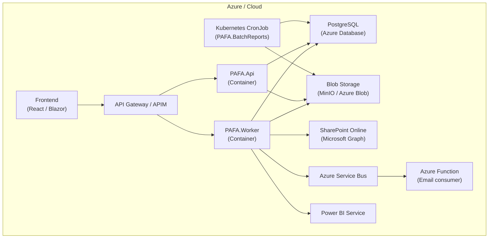
