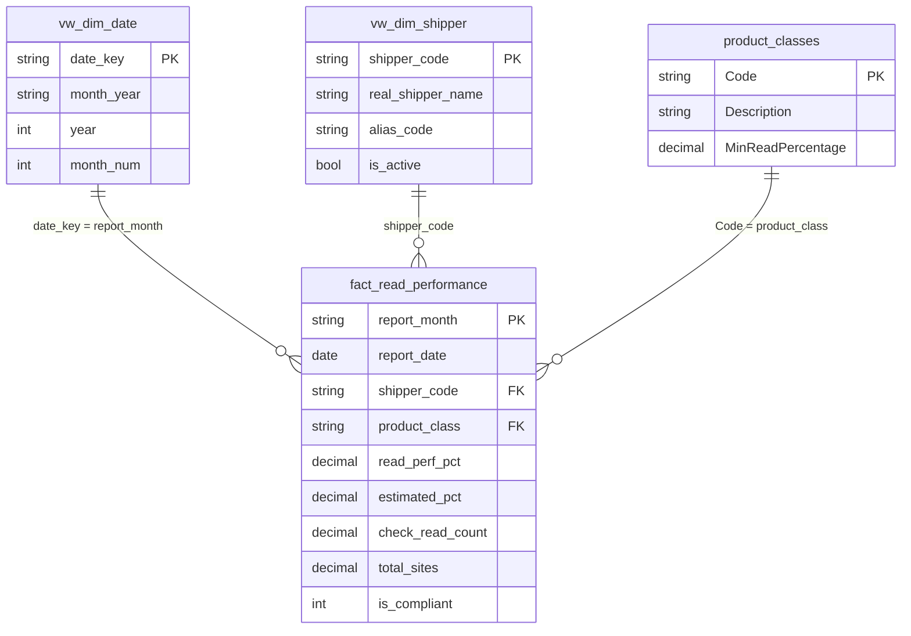
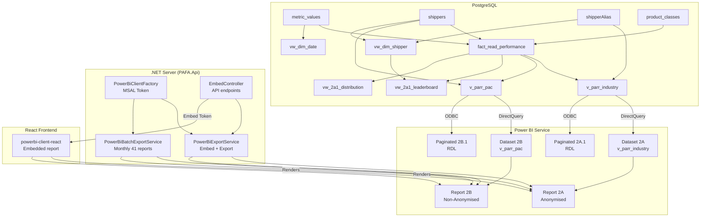

# PAFA — SQL Views Analysis & Power BI Integration Guide

> Complete analysis of existing PostgreSQL views, their role in the star schema,
> how they map to Power BI datasets, and the end-to-end publish + export flow.

---

## 1. Star Schema Overview



---

## 2. View-by-View Analysis

### 2.1 `fact_read_performance` (Fact Table)

| Column             | Type    | Source                      | Notes                                                   |
|--------------------|---------|-----------------------------|---------------------------------------------------------|
| `report_month`     | text    | `to_char(ReportingPeriod)`  | `YYYY-MM` format — join key to `vw_dim_date.date_key`   |
| `report_date`      | date    | `metric_values.ReportingPeriod` | Raw date for time-intelligence DAX                  |
| `shipper_code`     | text    | `metric_values.ShipperShortCode` | FK → `vw_dim_shipper.shipper_code`                |
| `product_class`    | text    | `metric_values.ProductClassCode` | FK → `product_classes.Code`                       |
| `read_perf_pct`    | decimal | Pivot: `MetricKey = 'ReadPerfPct'` | Read performance percentage                     |
| `estimated_pct`    | decimal | Pivot: `MetricKey = 'EstimatedPct'` | Estimated reads percentage                     |
| `check_read_count` | decimal | Pivot: `MetricKey = 'CheckReadCount'` | Number of check reads                        |
| `total_sites`      | decimal | Pivot: `MetricKey = 'TotalSites'` | Total supply points                              |
| `is_compliant`     | int     | Derived: `read_perf_pct >= MinReadPercentage` | 1 = compliant, 0 = non-compliant     |

**Key design**: Uses pivot (MAX + CASE) to transform the EAV `metric_values` table into a flat fact table. GROUP BY is on `(ReportingPeriod, ShipperShortCode, ProductClassCode, MinReadPercentage)`.

**Compliance rule**: `is_compliant = 1` when `read_perf_pct >= product_classes.MinReadPercentage` (typically 97.5%).

---

### 2.2 `vw_dim_date` (Date Dimension)

| Column       | Type | Source                              | Notes                          |
|--------------|------|-------------------------------------|--------------------------------|
| `date_key`   | text | `to_char(ReportingPeriod, 'YYYY-MM')` | Join key to fact table       |
| `month_year` | text | `to_char(ReportingPeriod, 'Mon-YY')` | Display label (e.g. "Mar-26") |
| `year`       | int  | `EXTRACT(YEAR)`                     | For Year slicer                |
| `month_num`  | int  | `EXTRACT(MONTH)`                    | For Month slicer               |

**Power BI**: Mark as Date Table. If you need daily granularity, generate a calendar table; for monthly reporting, this view suffices.

---

### 2.3 `vw_dim_shipper` (Shipper Dimension)

| Column              | Type | Source                                      | Notes                                        |
|---------------------|------|---------------------------------------------|----------------------------------------------|
| `shipper_code`      | text | `shippers.short_code`                       | PK — join key to fact table                  |
| `real_shipper_name` | text | `shippers.name`                             | **Only in PAC dataset — never in Industry**  |
| `alias_code`        | text | `COALESCE(shipperAlias.AliasCode, short_code)` | Used for anonymised Industry reports      |
| `is_active`         | bool | `shippers.is_active`                        | Filter inactive shippers if needed           |

**COMPLIANCE**: `real_shipper_name` must NEVER appear in Schedule 2A (Industry) datasets/reports.

---

### 2.4 `v_parr_industry` (Schedule 2A — Anonymised)

Joins `fact_read_performance` → `shippers` → `shipperAlias` → `product_classes`.

| Column             | Anonymised? | Notes                                                    |
|--------------------|-------------|----------------------------------------------------------|
| `shipper_code`     | YES         | `COALESCE(alias_code, short_code)` — never real name     |
| `report_month`     | N/A         | From fact table                                          |
| `read_perf_pct`    | N/A         | Performance metric                                       |
| `estimated_pct`    | N/A         | Performance metric                                       |
| `check_read_count` | N/A         | Performance metric                                       |
| `total_sites`      | N/A         | Performance metric                                       |
| `is_compliant`     | N/A         | Derived compliance flag                                  |
| `unc_threshold`    | N/A         | `COALESCE(MinReadPercentage, 97.5)` — reference line     |

**Usage**: Power BI dataset for Schedule 2A reports. Connect via DirectQuery.

---

### 2.5 `v_parr_pac` (Schedule 2B — Non-Anonymised)

Same structure as `v_parr_industry` but adds `real_shipper_name`.

| Column              | Notes                                |
|---------------------|--------------------------------------|
| `shipper_code`      | Real short_code (not aliased)        |
| `real_shipper_name` | **Exposed** — only for PAC/PAFA roles |

**Usage**: Power BI dataset for Schedule 2B reports. Restricted access.

---

### 2.6 `vw_2a1_leaderboard` (Industry Leaderboard)

Ranks shippers by `estimated_pct` per month and product class.

| Column         | Notes                                                    |
|----------------|----------------------------------------------------------|
| `rank_worst`   | RANK() DESC — highest estimated = worst rank             |
| `rank_best`    | RANK() ASC — lowest estimated = best rank                |
| `shipper_code` | From `vw_dim_shipper.shipper_code` (alias_code)          |

**Usage**: Leaderboard visual in Schedule 2A.1 reports.

---

### 2.7 `vw_2a1_distribution` (Industry Distribution Histogram)

Buckets shippers by `estimated_pct` into 10% bins.

| Column         | Notes                                    |
|----------------|------------------------------------------|
| `pct_bin`      | "00-10%", "10-20%", ..., "90-100%"       |
| `shipper_count`| COUNT(*) per bin                          |

**Usage**: Histogram/bar chart showing distribution of shipper performance.

---

### 2.8 `vw_2a2_no_meter` (No-Meter Products)

Shows shipper–product class combinations with no meter data.

---

## 3. Power BI Dataset Mapping

| Dataset Name          | Schedule | View Source        | Anonymised | RLS Role   |
|-----------------------|----------|--------------------|------------|------------|
| PAFA_Schedule_2A      | 2A       | `v_parr_industry`  | YES        | `Shipper`  |
| PAFA_Schedule_2B      | 2B       | `v_parr_pac`       | NO         | (none/PAC) |
| PAFA_Dimensions       | Both     | `vw_dim_date`, `vw_dim_shipper`, `product_classes` | Mixed | — |

---

## 4. End-to-End: From Views → Publish → Export

### Step 1: Create Datasets in Power BI Desktop

1. Open Power BI Desktop → Get Data → PostgreSQL database.
2. Enter your server (`localhost:5432`), database (`pafadb`).
3. **For Schedule 2A dataset**: Import/DirectQuery the following:
   - `v_parr_industry` (fact)
   - `vw_dim_date` (dimension)
   - `vw_dim_shipper` (dimension — only `shipper_code`, `alias_code`, `is_active`)
   - `product_classes` (dimension)
   - `vw_2a1_leaderboard` (supplementary)
   - `vw_2a1_distribution` (supplementary)
4. **For Schedule 2B dataset**: Same but use `v_parr_pac` instead of `v_parr_industry`.

### Step 2: Configure Star Schema Relationships

In Model view, create:
- `vw_dim_date[date_key]` → `v_parr_industry[report_month]` (1:*, Single)
- `vw_dim_shipper[shipper_code]` → `v_parr_industry[shipper_code]` (1:*, Single)
- `product_classes[Code]` → `v_parr_industry[product_class]` (1:*, Single)

Mark `vw_dim_date` as Date Table (column: `date_key`).

### Step 3: Add DAX Measures

Paste measures from [DAX_MEASURES.md](./DAX_MEASURES.md).

### Step 4: Configure RLS

1. Modeling → Manage roles.
2. Create role `Shipper`:
   - Table: `vw_dim_shipper`
   - DAX filter: `[shipper_code] = USERPRINCIPALNAME()`
3. Test with "View as Roles" — select Shipper and enter a test alias code.

### Step 5: Build Report Pages

Create report pages matching the schedule:
- **Page 1**: KPI cards (Compliance %, Industry Average %, Total Sites)
- **Page 2**: Leaderboard table (from `vw_2a1_leaderboard`)
- **Page 3**: Distribution histogram (from `vw_2a1_distribution`)
- **Page 4**: Trend line (Compliance % over time)
- Add slicers: Year, Month, Product Class

### Step 6: Publish to Power BI Service

1. File → Publish → Select your workspace.
2. Note the **Workspace ID**, **Report ID**, **Dataset ID** from the URL.
3. Fill these into `appsettings.json`:
   ```json
   "PowerBi": {
     "WorkspaceId": "<workspace-guid>",
     "AnonymizedReportId": "<2A-report-guid>",
     "AnonymizedDatasetId": "<2A-dataset-guid>",
     "NonAnonymizedReportId": "<2B-report-guid>",
     "NonAnonymizedDatasetId": "<2B-dataset-guid>"
   }
   ```

### Step 7: Grant Service Principal Access

1. In Azure AD: register app, note Client ID + create secret.
2. In Power BI Admin Portal: enable "Service principals can use Power BI APIs".
3. Add the service principal to your workspace (Settings → Access → Add → App).
4. Fill `TenantId`, `ClientId`, `ClientSecret` in `appsettings.json`.

### Step 8: Test On-Demand Export (from .NET)

```bash
# Generate embed token for Industry (anonymised)
curl -X GET "https://localhost:5001/api/embed/token?audience=Industry&aliasCode=SH_001" \
  -H "Authorization: Bearer <jwt>"

# Export as PDF (Industry, anonymised)
curl -X POST "https://localhost:5001/api/embed/export" \
  -H "Authorization: Bearer <jwt>" \
  -H "Content-Type: application/json" \
  -d '{"audience": "Industry", "format": "Pdf", "aliasCode": "SH_001"}' \
  -o report_2A.pdf

# Export as PDF (PAC, non-anonymised)
curl -X POST "https://localhost:5001/api/embed/export" \
  -H "Authorization: Bearer <jwt>" \
  -H "Content-Type: application/json" \
  -d '{"audience": "Pac", "format": "Pdf"}' \
  -o report_2B.pdf
```

### Step 9: Test Batch Export (monthly automated)

The `PowerBiBatchExportService` runs automatically on the 1st of the month at 02:00 UTC.
For testing, set `TestTriggerDelayMinutes` in `appsettings.json`:

```json
"PowerBiBatchExport": {
  "IsEnabled": true,
  "TestTriggerDelayMinutes": 2
}
```

### Step 10: Validate Anonymisation

- Open the exported 2A PDF → verify NO real shipper names appear (only alias codes).
- Open the exported 2B PDF → verify real shipper names are present.
- Cross-check with the DB: `SELECT DISTINCT shipper_code FROM v_parr_industry;` should return alias codes only.

---

## 5. Paginated Reports (RDL)

Two RDL templates are provided in `docs/powerbi/rdl/`:

| File | Schedule | View | Notes |
|------|----------|------|-------|
| `Schedule_2A1_EstimatedCheckReads.rdl` | 2A.1 | `v_parr_industry` | Anonymised |
| `Schedule_2B1_EstimatedCheckReads_PAC.rdl` | 2B.1 | `v_parr_pac` | Non-anonymised |

### Publishing RDL to Power BI Service

1. Open the `.rdl` file in **Power BI Report Builder**.
2. Update the data source connection string.
3. File → Save As → Power BI Service → select your workspace.
4. Configure gateway credentials if needed.
5. The paginated report will appear alongside your regular reports.

> **Requirement**: Power BI Premium or Embedded capacity for paginated reports.

---

## 6. Architecture Diagram



---

## 7. Security Summary

| Layer | Mechanism | What it protects |
|-------|-----------|------------------|
| SQL Views | `v_parr_industry` exposes only `alias_code` | Data at source — impossible to leak real names |
| Power BI RLS | `[shipper_code] = USERPRINCIPALNAME()` | Shipper can only see their own row |
| EffectiveIdentity | Username = AliasCode in embed/export token | Server-side export filters to one shipper |
| API Authorization | `[Authorize(Policy = "CanViewAnonymised")]` | Only permitted roles can access endpoints |
| Separate Datasets | 2A uses `v_parr_industry`, 2B uses `v_parr_pac` | Complete separation of anonymised/non-anon data |
